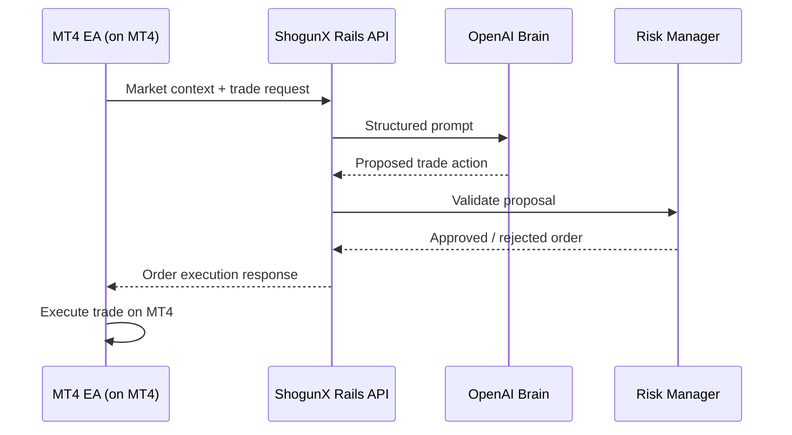

# ShogunX

ShogunX is our AI-powered trading bot. It runs on **MetaTrader 4 (MT4)** via an Expert Advisor (EA) for fast tick-to-API response, and connects to this Rails API backend for decision-making, risk checks, and order responses.

## Broker account (FBS)

Log in through **MT4 only** — the EA does not store broker login or password. ShogunX talks to your Rails API; MT4 talks to FBS when placing trades.

1. Install MT4 from FBS (or use your existing terminal).
2. **File → Login to Trade Account** (or the login dialog on startup).
3. Enter your FBS credentials:
   - **Server:** `FBS-Real-7` (real) — use the demo server from FBS if you are testing on demo first.
   - **Login** and **Password:** from the FBS client area (never commit these or paste them into this repo).
4. Confirm the chart shows your balance in the **Terminal** tab, then attach the ShogunX EA.

**Security:** Keep broker passwords out of git, `.env`, and the EA source. If a password was shared in chat or a screenshot, change it in the FBS cabinet and use the new one in MT4 only.

## MT4 installation

Source: [`mt4/ShogunX.mq4`](mt4/ShogunX.mq4)

1. Copy `mt4/ShogunX.mq4` into your MT4 data folder under `MQL4/Experts/` (or open it in MetaEditor and compile there).
2. Compile in MetaEditor (**Compile** or F7) to produce `ShogunX.ex4`.
3. In MT4, open **Navigator → Expert Advisors** and attach **ShogunX** to a chart.
4. Enable **AutoTrading** in the MT4 toolbar.
5. **Tools → Options → Expert Advisors** — enable *Allow WebRequest for listed URL* and add **`http://127.0.0.1`** (no `:3000` — MT4 only allows ports **80** / **443**). **Restart MT4** after changing this list.
6. Run **`make upd`** — exposes the API on host port **80** (mapped to Rails 3000 in Docker). EA inputs: **ApiHost** `127.0.0.1`, **ApiPort** `80`.
7. Signals URL becomes `http://127.0.0.1/api/v1/signals` (browser/curl on port 3000 still works: `http://localhost:3000`).

   **MT4 on Windows/VM, API on Mac:** set **ApiHost** to your Mac LAN IP (`make mt4-host`), whitelist `http://192.168.x.x`, keep **ApiPort** `80`.

7. Set **IntervalSeconds** (default **3** for testing; use **300** for 5m or **14400** for 4h production) to control how often the EA POSTs to the API.

### EA behavior

- Calls the API once when attached, then every **IntervalSeconds** (default **3** seconds) via an MT4 timer (works even when ticks are sparse).
- **POST**s JSON to `RailsUrl`:

  ```json
  {
    "symbol": "EURUSD",
    "entry": 1.08500,
    "sl": 1.08200,
    "tp": 1.09100
  }
  ```

  `entry` is the chart **Bid**; `sl` / `tp` use **SlOffset** / **TpOffset** inputs (defaults ±0.0030 / +0.0060).

- Logs HTTP status and the Rails JSON response in the **Experts** tab. Order execution from the response will be added once the full pipeline returns approved orders.

### Connect to local API

```bash
make upd
make status   # http://localhost:3000/up
```

With the EA on a chart and WebRequest allowed, you should see `Rails Response: {...}` in MT4 on each interval.

## Architecture

```
MT4 EA (installed on MT4)
  ↓
ShogunX Rails API
  ↓
OpenAI Brain
  ↓
Risk Manager
  ↓
Order Execution Response
  ↓
MT4 executes trade
```

| Step | Component | Role |
|------|-----------|------|
| 1 | **MT4 EA** | ShogunX client (`mt4/ShogunX.mq4`) installed on MT4. POSTs signals every **IntervalSeconds** (default 3s testing). |
| 2 | **ShogunX Rails API** | Backend for the trading bot. Authenticates the EA, orchestrates the pipeline, and returns a structured response. |
| 3 | **OpenAI Brain** | Evaluates the incoming context and proposes a trade action (direction, size, stops, etc.). |
| 4 | **Risk Manager** | Validates the proposal against account limits, exposure rules, and safety constraints before anything is sent back. |
| 5 | **Order Execution Response** | JSON payload returned to the EA with the approved (or rejected) order details. |
| 6 | **MT4** | Executes the approved trade on the broker terminal. |



## Backend development

This repo is the ShogunX Rails API — the server-side backend for the trading bot. The MT4 EA is installed separately on MetaTrader 4.

**Requirements:** Docker, Docker Compose, Make

```bash
cp .env.example .env   # set SHOGUNX_API_KEY and OPENAI_API_KEY
make build
make upd               # start db + web in the background
make db-setup          # prepare the development database
make status            # verify http://localhost:3000/up
```

Common commands: `make logs`, `make console`, `make test`, `make down`.

### CI locally (RuboCop + RSpec)

After changing the `Gemfile`, install gems in Docker once:

```bash
make bundle
```

Then:

```bash
make rubocop                 # lint (auto-runs bundle install if gems are missing)
make rspec                   # full suite (Docker)
make rspec SPEC=spec/requests/api/v1/signals_spec.rb
make ci                      # rubocop then rspec
make test                    # alias for make rspec
```

GitHub Actions runs **RuboCop**, **RSpec**, and security scans on every push/PR.

Optional env vars: `APP_PORT` (default `3000`), `DB_PORT` (default `5433`).

## Configuration

| Variable | Description |
|----------|-------------|
| `SHOGUNX_API_KEY` | Planned: secret the MT4 EA will send as `X-ShogunX-Api-Key` (not in EA yet) |
| `OPENAI_API_KEY` | OpenAI API key for the Brain layer |
| `RAILS_MASTER_KEY` | Rails credentials key (auto-loaded from `config/master.key` in dev) |

## Tech stack

- Ruby 3.3.6 / Rails 8.1
- PostgreSQL 16
- Docker + Kamal for deployment
