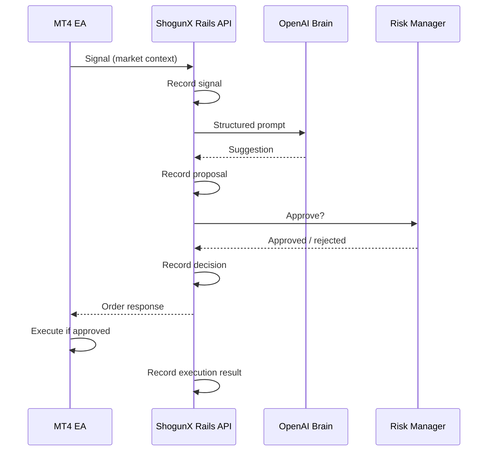

# ShogunX

ShogunX is our AI-powered trading bot. It runs on **MetaTrader 4 (MT4)** via an Expert Advisor (EA) for fast tick-to-API response, and connects to this Rails API backend for decision-making, risk checks, and order responses.

## ShogunX directions

**OpenAI suggests.**  
**Rails approves.**  
**MT4 executes.**  
**Rails records everything.**

| Principle | Meaning |
|-----------|---------|
| OpenAI suggests | The Brain proposes a trade (direction, size, stops) from market context. It does not place orders or bypass checks. |
| Rails approves | The API runs auth, risk limits, and policy. Only an approved (or explicit hold/reject) response goes back to the EA. |
| MT4 executes | The EA sends signals and, when told to, places trades on the broker terminal. No AI or Rails code runs inside MT4. |
| Rails records everything | Signals, proposals, approvals, rejections, and execution outcomes are persisted and auditable in this backend. |

Nothing trades on the broker until Rails approves it. Nothing is forgotten on the server side.

## Broker account (FBS)

Log in through **MT4 only** — the EA does not store broker login or password. ShogunX talks to your Rails API; MT4 talks to FBS when placing trades.

1. Install MT4 from FBS (or use your existing terminal).
2. **File → Login to Trade Account** (or the login dialog on startup).
3. Enter your FBS credentials:
   - **Server:** `FBS-Real-7` (real) — use the demo server from FBS if you are testing on demo first.
   - **Login** and **Password:** from the FBS client area (never commit these or paste them into this repo).
4. Confirm the chart shows your balance in the **Terminal** tab, then attach the ShogunX EA.

**Security:** Keep broker passwords out of git, `.env`, and the EA source. If a password was shared in chat or a screenshot, change it in the FBS cabinet and use the new one in MT4 only.

## MT4 installation

Source: [`mt4/ShogunX.mq4`](mt4/ShogunX.mq4)

1. Copy `mt4/ShogunX.mq4` into your MT4 data folder under `MQL4/Experts/` (or open it in MetaEditor and compile there).
2. Compile in MetaEditor (**Compile** or F7) to produce `ShogunX.ex4`.
3. In MT4, open **Navigator → Expert Advisors** and attach **ShogunX** to a chart.
4. Enable **AutoTrading** in the MT4 toolbar.
5. **Tools → Options → Expert Advisors** — enable *Allow WebRequest for listed URL* and add **`http://127.0.0.1`** (no `:3000` — MT4 only allows ports **80** / **443**). **Restart MT4** after changing this list.
6. Run **`make upd`** — exposes the API on host port **80** (mapped to Rails 3000 in Docker). EA inputs: **ApiHost** `127.0.0.1`, **ApiPort** `80`.
7. Signals URL becomes `http://127.0.0.1/api/v1/signals` (browser/curl on port 3000 still works: `http://localhost:3000`).

   **MT4 on Windows/VM, API on Mac:** set **ApiHost** to your Mac LAN IP (`make mt4-host`), whitelist `http://192.168.x.x`, keep **ApiPort** `80`.

7. **IntervalSeconds** defaults to **14400** (4 hours). Use **3** for local testing only.

### EA behavior

- Calls the API once when attached, then every **IntervalSeconds** (default **4 hours**) via an MT4 timer (works even when ticks are sparse).
- **POST**s a market snapshot JSON (fields match `MarketSnapshot` on Rails):

  ```json
  {
    "symbol": "XAUUSD",
    "timeframe": "H4",
    "timeframes": {
      "D1": { "price": 2650.10, "rsi": 58.2, "ema50": 2640, "ema200": 2600, "support": 2620, "resistance": 2680 },
      "H4": { "price": 2655.40, "rsi": 62.1, "ema50": 2650, "ema200": 2635, "support": 2640, "resistance": 2670 },
      "H1": { "price": 2656.00, "rsi": 55.0, "ema50": 2654, "ema200": 2650, "support": 2650, "resistance": 2665 }
    }
  }
  ```

  The EA sends **D1**, **H4**, and **H1** metrics each cycle (close price, RSI, EMA50/200, support/resistance over **SupportResistanceBars**). Flat payloads with top-level `price` / `rsi` / … are still accepted and applied to all three timeframes for backward compatibility.

- Parses the flat Rails JSON response and places pending orders when approved:
  - `HOLD` — no trade (logs `reason`)
  - `BUY_LIMIT` / `SELL_LIMIT` / `BUY_STOP` / `SELL_STOP` — `OrderSend` with `LotSize`, `MagicNumber`, SL/TP from Rails
- Polls `GET /api/v1/execution` on attach, each timer tick, and every **OrderPollSeconds** on tick to place Rails orders that are still `pending` (e.g. after a failed earlier EA run).
  - Skips duplicate `order_id` values (global variable + open-order comment `ShogunX#<id>`)
  - **POST**s `order_updates` for order lifecycle: `placed`, `triggered`, `cancelled`, `expired`, `closed`
  - **POST**s `position_updates` for position lifecycle: `open` (with `entry_price`), `closed` (with `profit_loss`)
  - Each callback updates Rails state and appends an `ExecutionAuditLog`
  - Polls open/history orders every **OrderPollSeconds** (default 5) via `OnTick`

#### MT4 → Rails feedback loop

| Step | Endpoint | Payload |
|------|----------|---------|
| Pending order sent | `POST /api/v1/order_updates` | `{ order_id, ticket, status: "placed" }` |
| Pending order fills | `POST /api/v1/order_updates` | `{ order_id, ticket, status: "triggered" }` |
| Position open | `POST /api/v1/position_updates` | `{ order_id, ticket, status: "open", entry_price }` |
| Position closed | `POST /api/v1/position_updates` | `{ order_id, ticket, status: "closed", profit_loss }` |
| Order closed (optional) | `POST /api/v1/order_updates` | `{ order_id, ticket, status: "closed", profit_loss }` |

Rails tracks: pending → placed → triggered → open position → closed position + `TradePerformance`, with full audit trail in `execution_audit_logs`.
- Logs all actions in the **Experts** tab (`VerboseLog=true`).

### Connect to local API

```bash
make upd
make status   # http://localhost:3000/up
```

With the EA on a chart and WebRequest allowed, you should see `Rails Response: {...}` in MT4 on each interval.

## Architecture

Flow matches [ShogunX directions](#shogunx-directions): suggest → approve → execute → record.

```
MT4 EA  →  POST signal
              ↓
         ShogunX Rails API  →  record signal
              ↓
         OpenAI Brain  →  suggestion (record proposal)
              ↓
         Risk / policy  →  approve or reject (record decision)
              ↓
         JSON order response  →  record outcome sent to EA
              ↓
         MT4 EA  →  execute on broker (if approved)
```

| Step | Component | Role |
|------|-----------|------|
| 1 | **MT4 EA** | Client on MT4. POSTs snapshots every **IntervalSeconds** (default 4h). Executes only approved orders. |
| 2 | **ShogunX Rails API** | Orchestrates the pipeline, approves or rejects, **records everything**, returns structured JSON to the EA. |
| 3 | **OpenAI Brain** | **Suggests** a trade action from context. Does not approve or execute. |
| 4 | **Risk Manager** | Part of Rails approval: limits, exposure, safety before any order is returned. |
| 5 | **Order response** | Approved, hold, or rejected payload for the EA. |
| 6 | **MT4** | **Executes** approved trades on the broker terminal. |



## Backend development

This repo is the ShogunX Rails API — the server-side backend for the trading bot. The MT4 EA is installed separately on MetaTrader 4.

**Requirements:** Docker, Docker Compose, Make

```bash
cp .env.example .env   # set SHOGUNX_API_KEY and OPENAI_API_KEY
make build
make upd               # start db + web in the background
make db-setup          # prepare the development database
make status            # verify http://localhost:3000/up
```

Common commands: `make logs`, `make console`, `make test`, `make down`.

### News filter (ForexFactory)

`NewsFilterService` syncs high-impact USD events from the [ForexFactory calendar](https://nfs.faireconomy.media/ff_calendar_thisweek.json) and blocks new trades from **60 minutes before** through **60 minutes after** each release (aligned with the Brain prompt). `RiskRuleService` surfaces the rejection as `high impact USD news: <event title>`.

`OpenaiAnalysisService` includes the same calendar context in every Brain prompt via `NewsContextService` (blackout status + upcoming USD high-impact releases), so the model can prefer **WAIT** near news even before the risk gate runs.

Background sync: `ForexFactoryCalendarSyncJob` (respects a 5-minute throttle). Set `FOREXFACTORY_SYNC_ON_FILTER=true` to refresh on every risk check (default in production). `FOREXFACTORY_SYNC_ON_OPENAI` controls sync before OpenAI analysis (defaults to the same value as `FOREXFACTORY_SYNC_ON_FILTER`).

### Three take-profit orders

When the pipeline approves a trade, `OrderPlanService` creates **three** `pending` orders (same entry, SL, and signal) with take profits at **20 / 30 / 40 pips**, each **capped** by the structural target (resistance for buys, support for sells).

| Leg | Pips | Example (BUY @ 3350, max TP 3380) |
|-----|------|-----------------------------------|
| 1 | 20 | 3370 |
| 2 | 30 | 3380 (capped) |
| 3 | 40 | 3380 (capped) |

The MT4 EA executes them **one at a time** via `GET /api/v1/execution` (oldest / lowest `tp_leg` first). Each uses the full EA `LotSize` — three legs means **3× lot exposure** unless you lower `LotSize`.

For XAUUSD, one pip = **$1** on price by default (`SHOGUNX_PIP_SIZE=1.0`). Override with `SHOGUNX_PIP_SIZE` or `SHOGUNX_PIP_SIZE_BY_SYMBOL=XAUUSD=0.1` if your broker uses 0.1 per pip.

Run `make db-migrate` after pulling to add the `tp_leg` column on `orders`.

### Trade statistics (dashboard)

`GET /api/v1/statistics` — aggregated from closed `TradePerformance` records via `TradePerformanceService`.

Query params (optional): `from`, `to`, `symbol`, `daily_days` (default 30), `monthly_months` (default 12).

Response includes `summary` (total trades, wins, losses, win rate, profit factor, average RR, P/L totals), `daily_pnl`, and `monthly_pnl` time series.

### CI locally (RuboCop + RSpec)

After changing the `Gemfile`, install gems in Docker once:

```bash
make bundle
```

Then:

```bash
make rubocop                 # lint (auto-runs bundle install if gems are missing)
make rspec                   # full suite (Docker)
make rspec SPEC=spec/requests/api/v1/signals_spec.rb
make ci                      # rubocop then rspec
make test                    # alias for make rspec
```

GitHub Actions runs **RuboCop**, **RSpec**, and security scans on every push/PR.

Optional env vars: `APP_PORT` (default `3000`), `DB_PORT` (default `5433`).

## Configuration

| Variable | Description |
|----------|-------------|
| `SHOGUNX_API_KEY` | Planned: secret the MT4 EA will send as `X-ShogunX-Api-Key` (not in EA yet) |
| `OPENAI_API_KEY` | OpenAI API key for `OpenaiAnalysisService` (required for live analysis) |
| `OPENAI_MODEL` | Optional model override (default `gpt-4o-mini`) |
| `FOREXFACTORY_CALENDAR_URL` | Optional override (default `https://nfs.faireconomy.media/ff_calendar_thisweek.json`) |
| `FOREXFACTORY_SYNC_ON_FILTER` | Refresh calendar before risk checks (default `true` outside test) |
| `FOREXFACTORY_SYNC_ON_OPENAI` | Refresh calendar before OpenAI prompts (defaults to `FOREXFACTORY_SYNC_ON_FILTER`) |
| `SHOGUNX_PIP_SIZE` | Price distance per pip (default `1.0` for XAUUSD) |
| `SHOGUNX_PIP_SIZE_BY_SYMBOL` | Per-symbol overrides, e.g. `XAUUSD=1.0,EURUSD=0.0001` |
| `RAILS_MASTER_KEY` | Rails credentials key (auto-loaded from `config/master.key` in dev) |

## Deploy to Heroku

1. Create the app and Postgres (or use the Heroku button with `app.json`):

   ```bash
   heroku create shogunx-api --stack heroku-24
   heroku buildpacks:add heroku-community/apt
   heroku buildpacks:add heroku/ruby
   heroku addons:create heroku-postgresql:essential-0
   ```

2. Set config vars (secrets are not committed to git):

   ```bash
   heroku config:set RAILS_MASTER_KEY="$(cat config/master.key)"
   heroku config:set SHOGUNX_API_KEY=your-secret
   heroku config:set OPENAI_API_KEY=sk-your-key
   heroku config:set RAILS_HOST=$(heroku info -s | awk -F= '/web_url/ {gsub(/https:\/\//,"",$2); gsub(/\//,"",$2); print $2}')
   # When the dashboard is live, allow browser requests:
   # heroku config:set CORS_ORIGINS=https://your-dashboard.vercel.app
   ```

3. Deploy manually (optional):

   ```bash
   git push heroku master
   ```

   Migrations run automatically via the `release` phase in `Procfile` (`rails db:prepare`).

4. **GitHub Actions** (`.github/workflows/deploy-heroku.yml`):

   Add repository secrets under **Settings → Secrets and variables → Actions**:

   | Secret | Value |
   |--------|-------|
   | `HEROKU_API_KEY` | From [Heroku Account → API Key](https://dashboard.heroku.com/account) |
   | `HEROKU_EMAIL` | Your Heroku account email |

   After merging to `master`, every push to `master` deploys automatically (CI runs separately on the same push). You can also trigger a deploy manually from the Actions tab.

   **Do not use a GitHub Release to deploy** — merge the Heroku branch into `master` and push; the workflow handles the rest.

5. Verify:

   ```bash
   heroku open /up -a shogunx-api
   ```

`DATABASE_URL` is set automatically by Heroku Postgres. Docker/Kamal files remain for local dev; production hosting is Heroku buildpacks (`Procfile`, `Aptfile` for `libvips`).

## Tech stack

- Ruby 3.3.6 / Rails 8.1
- PostgreSQL 16
- Docker for local dev; Heroku for production
